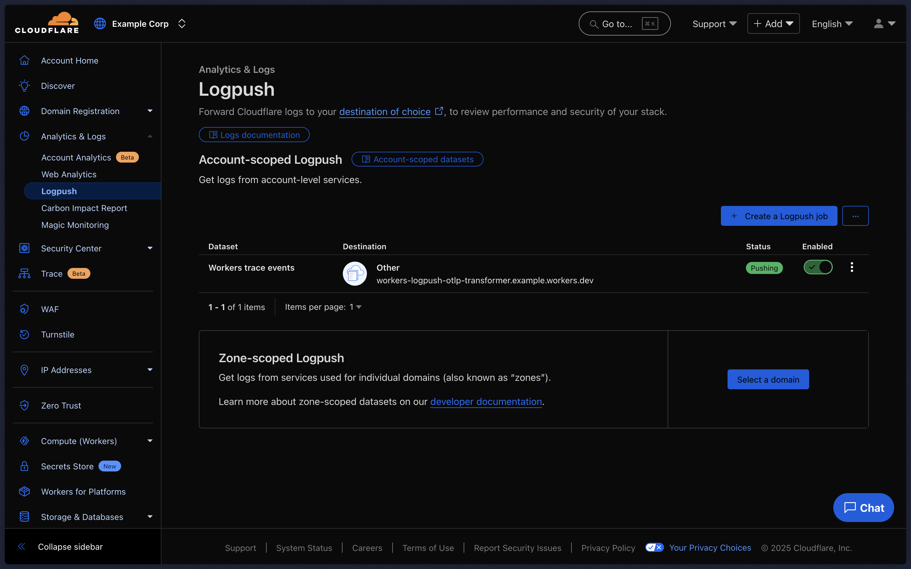

# workers-logpush-otlp-transformer

This Worker provides a [Logpush](https://developers.cloudflare.com/logs/about/) destination that transforms [Workers Trace Events](https://developers.cloudflare.com/logs/reference/log-fields/account/workers_trace_events/) into the OpenTelemetry Protocol (OTLP) format. This enables integration with existing observability systems that support OTLP.

## Destinations

Your destination must be [OTLP compliant](https://opentelemetry.io/docs/reference/specification/protocol/otlp/). If you are using a custom OpenTelemetry Collector, you can use the [OTLP Receiver](https://github.com/open-telemetry/opentelemetry-collector/tree/main/receiver/otlpreceiver) to ingest logs.

## Enablement

### Configure and Deploy the Worker

1.  **Copy Environment Variables**: Duplicate the `dev.vars.sample` file and rename it to `.dev.vars`.
2.  **Populate Variables**: Edit `.dev.vars` with the following:
    *   An OTLP compliant destination URL.
    *   Any headers required by the upstream OTLP destination.
    *   An optional `AUTHORIZATION` header to secure your Worker endpoint. Only requests with this header will be processed.

    ```ini
    # If present, any request to transform logs will require this
    # as the authorization header
    AUTHORIZATION=some-secret-value

    # Where OTLP logs are exported to
    DESTINATION=http://otlp.logging.com/

    # Any aditional headers you want to send to your OTLP destination can be via
    # DESTINATION_HEADER_(header_name)=value
    DESTINATION_HEADER_Authorization=otlp-authorization
    ```
3.  **Deploy Secrets and Worker**:

    ```bash
    pnpm wrangler secret bulk .dev.vars
    pnpm run deploy
    ```

After deployment, you can find your Worker in the Cloudflare dashboard under [Workers & Pages](https://dash.cloudflare.com/?to=/:account/workers/services/). Note the Worker's URL (e.g., `https://workers-logpush-otlp-transformer.example-corp.workers.dev/`). This URL will be used when creating the Logpush job.

## Creating the Logpush Job

To create a Logpush job that sends logs to your deployed Worker visit the [Create Logpush Job](https://dash.cloudflare.com/?to=/:account/logs/create) page and select the `HTTP Destination` destination type. You'll be prompted for the destination you'd like to send your logs to, enter the Worker's deployment URL you noted down earlier. 

### Destination Headers

If you configured an `AUTHORIZATION` secret in your Worker's `.dev.vars` file, you must include this as a header in the Logpush job. Add it as a URL parameter to your destination URL. For example: `https://workers-logpush-otlp-transformer.example-corp.workers.dev?header_Authorization=some-secret-value`.

### Select Dataset

Choose the `Workers Trace Events` dataset.

### Configure Job Settings

Apply any necessary filters and select the fields from the `Workers Trace Events` dataset that you want to ingest. Refer to the [Workers Trace Events dataset documentation](https://developers.cloudflare.com/logs/reference/log-fields/account/workers_trace_events/) for more information on available fields.

### Verify Job Creation

After creating the job, go to the [Logpush Jobs](https://dash.cloudflare.com/?to=/:account/logs/jobs) page. Your new job should be listed with a status of `Pushing`.



## Opting Workers into Logpush

By default, individual Workers do not send their logs to Logpush, you must explicitly enable Logpush for each Worker you want to monitor. For instructions on how to do this, refer to the [Enable logging on your Worker](https://developers.cloudflare.com/workers/observability/logs/logpush/#enable-logging-on-your-worker) section of the Cloudflare Workers documentation.
